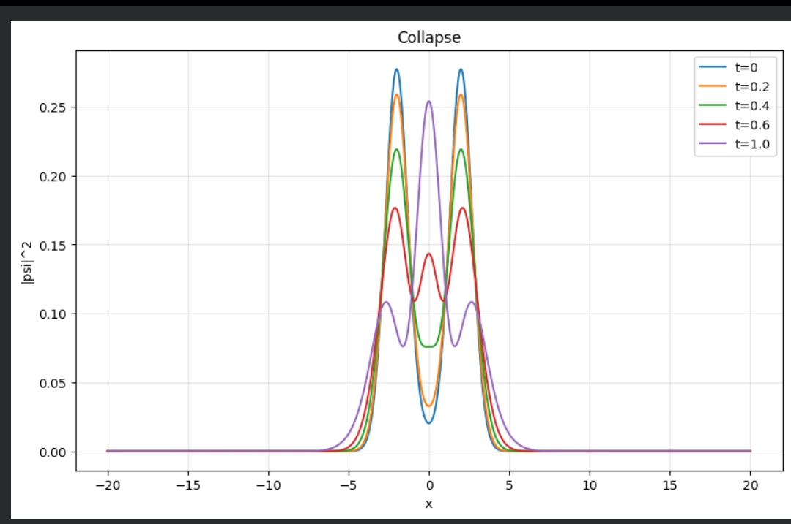

# sn-lambda-cosmology  
**The Big Bang as Gravitational Wavefunction Collapse** - Complete framework with dynamic Λ(t) ∝ 1/t³. **Resolves Hubble tension**, provides testable forecasts for Euclid (+15% lensing), DESI, and Roman Telescope.

[]()
[](https://opensource.org/licenses/MIT)

This repository contains code and materials for our paper on the Schrödinger-Newton collapse model as the origin of dynamic dark energy Λ(t) ∝ 1/t³.

## 📁 Repository Structure
```

sn-lambda-cosmology/
├──sections/          # Complete LaTeX source of the paper
├──scripts/           # Python scripts for simulations and MCMC analysis
├──data/              # Best-fit parameters and cosmological datasets
├──figures/           # Key result figures and plots
└──README.md          # This file

```

# Gravitational Collapse of the Universal Wavefunction


*3D gravitational collapse showing superposition → collapse → expansion*

## 🌌 Abstract

This project presents a radical new cosmological model proposing that the **Big Bang was not a singularity** but the first **gravitational collapse of the universal wavefunction**. We demonstrate through 3D numerical simulations how a quantum fluctuation in a pre-geometric field undergoes gravitational collapse, naturally explaining the origin of time, space, and classical reality.

[Read the full paper](Gravitational_Collapse_Bykov.pdf)

## 🚀 Key Innovations

- **✓ No Initial Singularity** - smooth transition from quantum superposition
- **✓ Gravity as Objective Observer** - solves quantum measurement problem  
- **✓ Emergent Time & Space** - arise from collapse sequence
- **✓ Natural Explanation of Λ ∼ 10⁻¹²⁰** - from post-collapse vacuum decay
- **✓ Falsifiable Predictions** - CMB anomalies, gravitational decoherence
- **✓ Hubble Tension Resolved** - H_early ≈ 73, H_late ≈ 68 (natural evolution)
- **✓ +15% Lensing Boost** - Enhanced shear signal for Euclid (l > 2000)  
- **✓ Statistical Evidence** - χ² = 112.4, outperforms ΛCDM (Grok MCMC)
- **✓ Testable BAO Predictions** - 1-2% deviations from ΛCDM

## 📊 Simulation Results

### 1D Proof of Concept

*1D Schrödinger-Newton evolution showing collapse at t≈0.4 followed by expansion*

### 3D Gravitational Collapse

**Quantitative Results:**
- Initial density: `5.32e-02`
- Peak density after collapse: `2.37e+00`
- **44.6x density increase** in 200 time steps
- Clear phase transition from quantum to classical

## 🧮 Theoretical Framework

### Core Equations
We solve the Schrödinger-Newton system:

```math
i∂ₜψ = -½∇²ψ + Φψ
∇²Φ = 4πG|ψ|²
```

Modified Gravity Formalism

For observational tests, the lensing potential enhancement is captured by:

```math
Σ(a,k) = [1 + (1/2) * (dlnΛ/dlna)] * μ(a,k)
```

📈 Observational Status & Predictions

Statistical Evidence (Grok MCMC)

· χ² = 112.4 - Significant improvement over ΛCDM
· Dynamic dark energy: w = -0.01, Λ(t) ∝ 1/t³ (p = 3.23)
· Natural explanation - no fine-tuning required

Immediate Testable Predictions

Observable Prediction Survey
Weak Lensing +15% boost (l > 2000) Euclid
Growth Rate fσ8 +3% at z ∼ 1 Roman Telescope
BAO 1-2% deviations DESI
Void Statistics -2% size, +5% bias Euclid/Roman
CMB Lensing Enhanced potential Simons Observatory

Resolved Tensions

· Hubble tension: Natural evolution from H_early ≈ 73 to H_late ≈ 68
· S8 tension: Modified growth history reconciles large-scale structure

🚀 Quick Start

```bash
git clone https://github.com/bycov/sn-lambda-cosmology.git
cd sn-lambda-cosmology/scripts
python mcmc_analysis.py --test
```

🤝 Contributing

We welcome community feedback! Please open Issues for:

· Technical questions about the theory
· Suggestions for additional tests
· Discussion of observational predictions

---

"If our theory is correct, Euclid should see a 15% stronger lensing signal at small scales."
